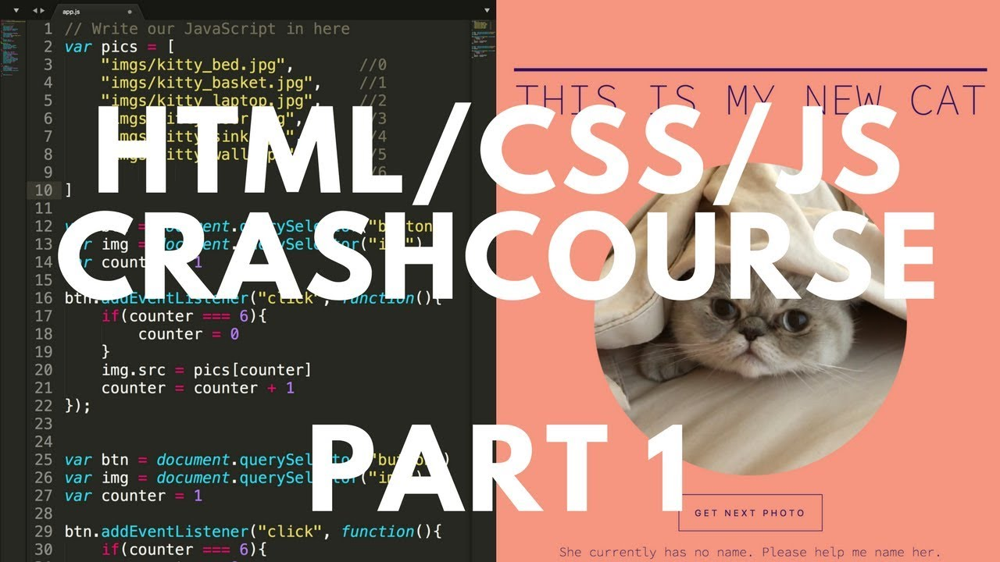

# Quickstart

Read the [prework](./README.md) assignment.

Example [site](https://jake-armstrong.surge.sh) and [source code](https://github.com/jlarmstrongiv/jake-armstrong).

_Crash course on [YouTube](https://www.youtube.com/playlist?list=PLHiGtNshvZ3BRExT8d34We2Ep_nnI7aWf)_

_Additional practice on [YouTube](https://www.youtube.com/playlist?list=PLxhuIQQ59yy9iqA5AIoBBv6i_vvhRUaGm)_

## Helpful resources

- https://www.internetingishard.com/
- https://developer.mozilla.org/en-US/docs/Web
